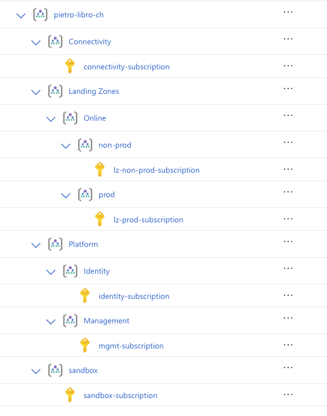

# iac-webapp-stack

This repository provides a modular, multi-cloud infrastructure-as-code (IaC) stack for deploying secure web applications and containers on Azure and AWS using Terraform. The example below demonstrates how to set up and deploy a web application on Azure, leveraging Terraform for resource provisioning and state management.

## Overview

The following steps will guide you through:
1. Setting up required environment variables.
2. Creating a Service Principal for Terraform authentication.
3. Setting environment variables for Azure login.
4. Logging in with the Service Principal.
5. Creating resource groups for your application and Terraform state.
6. Setting shared values for Terraform state.
7. Creating a storage account and container for Terraform state.
8. Initializing Terraform and deploying your application.

## Prerequisites

- Azure CLI installed and authenticated.
- Terraform installed.
- Sufficient permissions to create resources in your Azure subscription.

## Landing Zone

This IaC stack is designed to be deployed in a dedicated landing zone (online\\non-prod\\lz-non-prod-subscription), which includes the following components:

- **Resource Group**: A dedicated resource group for the web application.
- **Web Application**: An Azure Web App for hosting the application.
- **App Service Plan**: An App Service Plan to define the hosting environment for the web application.
- **Virtual Network**: A virtual network for network isolation and security.
- **Service Principal**: A service principal for Terraform to manage resources securely.
- **Storage Account**: A storage account for storing the Terraform state file.
- **Container**: A container within the storage account to hold the Terraform state file.

##  Management Groups and Subscriptions
This IaC stack is designed to be deployed in a dedicated landing zone (online\\non-prod\\lz-non-prod-subscription). Below is the structure of the management groups and subscriptions:





## Step 1: Set Environment Variables

Set the following environment variables to define resource names and locations. Adjust values as needed for your environment.

```Bash
# Set environment variables for the Azure web application stack.
export TF_VAR_AZ_IAC_WEBAPP_RESOURCE_GROUP_LOCATION="westus"
export TF_VAR_AZ_IAC_WEBAPP_RESOURCE_GROUP_NAME="iac-webapp-rg"
export TF_VAR_AZ_IAC_WEBAPP_VNET_NAME="iac-webapp-vnet"
export TF_VAR_AZ_IAC_WEBAPP="iac-webapp"
export TF_VAR_AZ_IAC_WEBAPP_SRV_PLAN="iac-webapp-srv-plan"

# Set the resource group name for Terraform state management.
export TF_VAR_AZ_IAC_TF_STATE_RESOURCE_GROUP_LOCATION="switzerlandnorth"
export TF_VAR_AZ_IAC_TF_STATE_RESOURCE_GROUP_NAME="iac-tfstate-rg"
```

## Step 2: Create a Service Principal

Create a Service Principal for Terraform to authenticate with Azure.

```Bash
az ad sp create-for-rbac --name tf-iac-webapp-sp --role Contributor
```

_Note: Store the output securely. Do not commit credentials to version control._

## Step 3: Set Environment Variables for the Azure Login using Service Principal

```Bash
export ARM_SUBSCRIPTION_ID="<azure_subscription_id>"
export ARM_TENANT_ID="<azure_tenant_id>"
export ARM_CLIENT_ID="<azure_sp_client_id>"
export ARM_CLIENT_SECRET="<azure_sp_client_secret>"
```

## Step 4: Log In Using the Service Principal

Authenticate with Azure using the Service Principal credentials.

```Bash
az login --service-principal -u $ARM_CLIENT_ID -p $ARM_CLIENT_SECRET --tenant $ARM_TENANT_ID
```

## Step 5: Create Resource Groups

Create a resource group for the Terraform state management.

```Bash
az group create --name $TF_VAR_AZ_IAC_TF_STATE_RESOURCE_GROUP_NAME \
  --location $TF_VAR_AZ_IAC_TF_STATE_RESOURCE_GROUP_LOCATION
```

## Step 6: Set Shared Values for Terraform State

Define environment variables for the Terraform state backend.

```Bash
export IAC_TF_STATE_RESOURCE_GROUP=iac-tfstate-rg
export IAC_TF_STATE_LOCATION=switzerlandnorth
export IAC_TF_STATE_STRACC_NAME=tf20250609stracc
export IAC_TF_STATE_CONTAINER_NAME=tf-states-container
export IAC_TF_STATE_KEY_NAME=azure-iac-webapp-stack.terraform.tfstate
```

## Step 7: Create Storage Account and Container for Terraform State

Provision a storage account and container to store the Terraform state file.

```Bash
az storage account create --name $IAC_TF_STATE_STRACC_NAME \
  --location $IAC_TF_STATE_LOCATION --sku Standard_LRS \
  --resource-group $IAC_TF_STATE_RESOURCE_GROUP

az storage container create --name $IAC_TF_STATE_CONTAINER_NAME \
  --account-name $IAC_TF_STATE_STRACC_NAME

az storage account keys list --resource-group $IAC_TF_STATE_RESOURCE_GROUP --account-name $IAC_TF_STATE_STRACC_NAME
```

## Step 8: Initialize Terraform Backend

Initialize Terraform, configuring the backend to use the Azure storage account.

```Bash
terraform init \
  -backend-config="resource_group_name=${IAC_TF_STATE_RESOURCE_GROUP}" \
  -backend-config="storage_account_name=${IAC_TF_STATE_STRACC_NAME}" \
  -backend-config="container_name=${IAC_TF_STATE_CONTAINER_NAME}" \
  -backend-config="key=${IAC_TF_STATE_KEY_NAME}"
```

## Step 9: Plan and Apply Terraform Deployment

Generate and apply a Terraform execution plan to deploy your application.

```Bash
terraform plan -out=iac-webapp-stack.tfplan
terraform apply "iac-webapp-stack.tfplan"
```

## Step 10: Destroy Resources (Optional)

To remove all resources created by this stack:

```Bash
terraform destroy
```
---

By following these steps, you will have a fully provisioned and running web application environment on Azure, managed via Terraform and ready for further customization.